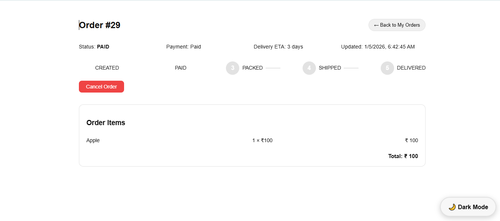
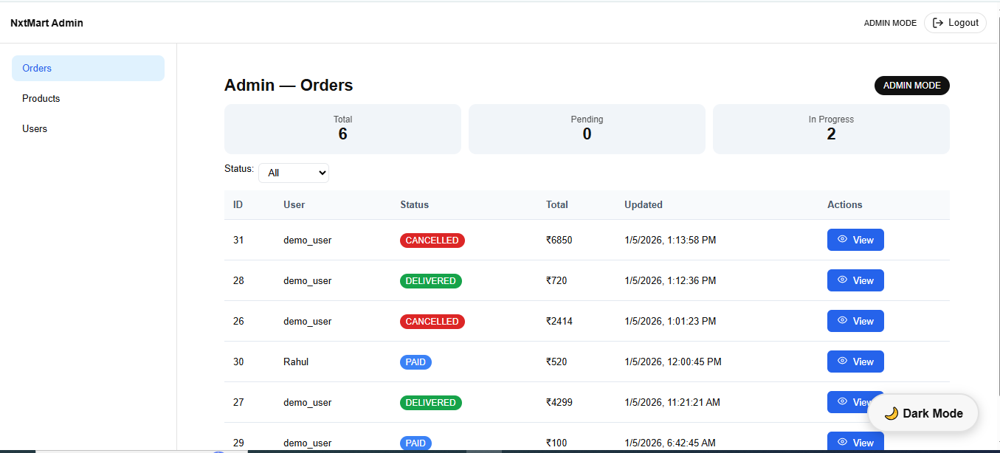
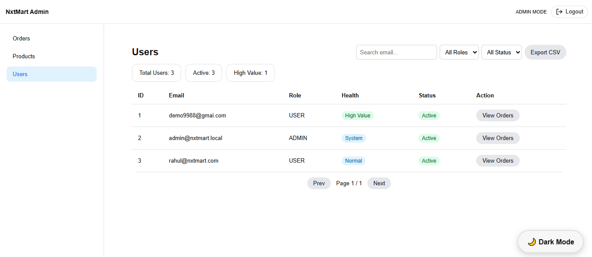

# 🛍️ NxMart — Order Management Platform

A modern, secure, and modular Order Management Platform built with React, Node.js, Express, SQLite, and JWT — designed to model real-world catalog, cart, checkout, and order fulfillment workflows with role-based control and auditability.

Built with React, Node.js, Express, SQLite, and JWT authentication, this project focuses on clean architecture, security, and scalable system design rather than just UI screens.

## 🚀 Overview

NxMart is a full-stack Order Management Platform that models the core business workflows of an e-commerce system — from product discovery to checkout, order creation, fulfillment updates, and order history.

Unlike a basic CRUD shop, this system focuses on:

- Clean separation of frontend, backend, and data layers
- Secure authentication and role-based authorization
- Realistic order lifecycle and admin operations
- Modular architecture suitable for extension and scaling
- Interview-ready system explanation and structure

The project demonstrates how modern engineering teams design, secure, and structure full-stack business systems.


## 🔄 Core Business Workflows

### User Flow
1. Browse products with filtering and search.
2. Add products to cart and manage quantities.
3. Checkout via protected routes (authentication required).
4. Order is created securely through backend API.
5. User can view order details and order history.

### Admin Flow
1. View all orders in the system.
2. View order details and history.
3. Update order status (processing, shipped, delivered, etc.).
4. Enable or disable users and products.
5. Maintain system integrity through role-restricted APIs.

## 🔐 Role-Based Access Control (RBAC)

| Role  | Capabilities |
|--------|--------------|
User   | Browse, cart, checkout, view own orders and history |
Admin  | Manage products, view all orders, update order status, manage users |

RBAC is enforced using middleware (`auth`, `requireRole`) on the backend and protected routes on the frontend.


## 🧩 Key Engineering Features

| Area | Implementation |
|------|----------------|
Authentication | JWT-based login, bcrypt password hashing |
Authorization | Role-based access using middleware |
Order Lifecycle | Catalog → Cart → Checkout → Order → Status updates |
Frontend Architecture | Modular React components with hooks |
Backend Architecture | Controllers, services, repositories layered structure |
Validation | Zod used for request and input validation |
Security | Protected routes, input sanitization, safe sorting whitelist |
Persistence | SQLite database with migrations |
Deployment | Frontend on Vercel, Backend on Render |
Responsiveness | Mobile-first UI using Styled Components |


## 🧠 Key Design Decisions

- Chose SQLite for simplicity, portability, and interview friendliness.
- Used layered architecture to avoid tight coupling between business logic and infrastructure.
- Enforced authorization on backend rather than trusting frontend.
- Implemented whitelist-based sorting to prevent injection risks.
- Kept cart state local for responsiveness and reduced server load.

## 🔒 Security Considerations

- Passwords are hashed using bcrypt before storage.
- JWT tokens are verified on every protected request.
- Role-based middleware restricts admin-only operations.
- Input and query parameters are validated using Zod.
- Sensitive environment variables are excluded from version control.


## 🏗️ System Architecture
```
[ React Frontend ] ⇄ [ Express REST API ] ⇄ [ SQLite Database ]
                     │
                     ├─ JWT Authentication
                     ├─ Role-Based Authorization
                     ├─ Validation & Sanitization
                     └─ Order & User Controllers
```

## 🛠️ Backend Structure
```
backend/src/
├── config/         # Environment & configuration
├── controllers/    # Business logic handlers
├── database/       # DB connection & setup
├── middleware/     # Auth & RBAC middlewares
├── migrations/     # Schema evolution
├── repositories/   # Data access layer
├── routes/         # API route definitions
├── services/       # Core business services
├── validators/     # Request validation
└── server.js       # App entry point
```
## 🎨 Frontend Structure
```
frontend/src/
├── api/           # API communication layer
├── components/    # Reusable UI components
├── context/       # Auth & app state context
├── layouts/       # Shared layouts
├── pages/         # Application pages
├── theme/         # Light/Dark themes
├── validators/    # Client-side validation
└── App.js         # App root
```
## 🔌 API Design Highlights

### Public
GET    /products
GET    /products/:id

### Auth
POST   /auth/register
POST   /auth/login

### User Orders
POST   /orders
GET    /orders
GET    /orders/:id
GET    /orders/:id/history

### Admin
GET    /admin/orders
PUT    /admin/orders/:id/status
GET    /admin/users
PATCH  /admin/users/:id/toggle

## 🎨 Frontend Engineering Highlights

- State managed through React hooks and context where appropriate
- Centralized API layer for consistent backend communication
- Protected routes for cart and checkout access
- Graceful handling of loading, error, and empty states
- Theming system implemented with Styled Components

## 🛠️ Backend Engineering Highlights

- RESTful APIs following resource-based routing
- Controllers separated from business logic and data access
- Secure password storage using bcrypt
- JWT authentication with middleware enforcement
- Query parameter whitelisting for safe sorting and filtering


## ✨ Why This Project Stands Out

✔️ Models realistic order workflows, not just CRUD  
✔️ Demonstrates layered backend architecture  
✔️ Uses secure JWT authentication and RBAC  
✔️ Separates concerns cleanly across frontend and backend  
✔️ Implements real admin and user flows  
✔️ Shows understanding of business logic, not just UI  
✔️ Written with interview explanation and clarity in mind  


## 🛠️ Local Setup

Backend:
cd backend  
npm install  
npm start  
→ http://localhost:5000

Frontend:
cd frontend  
npm install  
npm start  
→ http://localhost:3000

---

## 🚀 Deployment

| Service | Provider | Status |
|--------|----------|---------|
| Frontend | Vercel | Live |
| Backend | Render | Live |
| Database | SQLite | Local |


### Live Demo

| Service                     | URL                                                                                    |
| --------------------------- | -------------------------------------------------------------------------------------- |
| 🌐 **Frontend (Vercel)**    | [https://frontend-nxt-mart-ctio.vercel.app](https://frontend-nxt-mart-ctio.vercel.app) |
| 🔌 **Backend API (Render)** | [https://nxtmartbackend-5.onrender.com](https://nxtmartbackend-5.onrender.com)          |


## ScreenShots
### Login Page

### Home Dark Mode Page

### Product Details Page

### Cart Page

### Checkout Page

### User Order Details Page

### Admin Dashboard Page

### Admin Users Page



## 🔮 Future Improvements

- Payment gateway integration (Stripe / Razorpay)
- Order status notifications
- Pagination for large catalogs
- Refresh token rotation
- Automated test coverage


## 🙋‍♂️ Author

**Venkatesh Karthan**  
Full-Stack Developer | React | Node.js | SQL  

This project represents my hands-on learning in building secure, modular, and scalable web systems.

