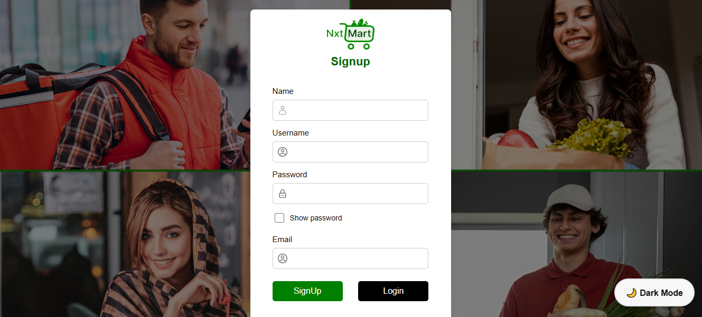
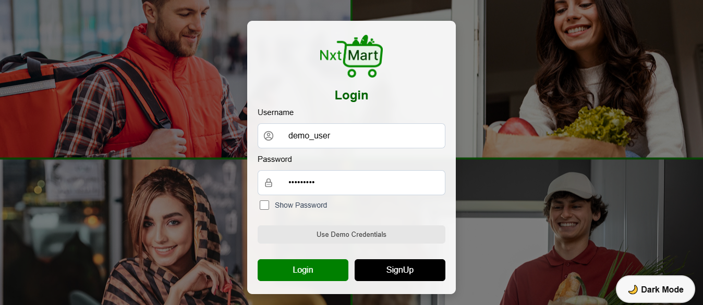
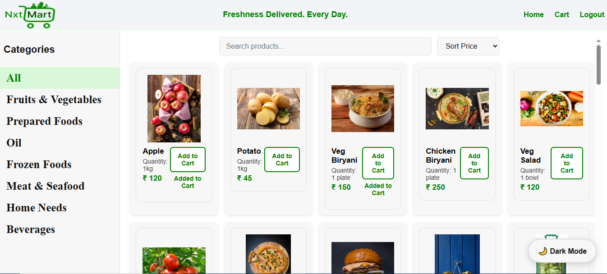
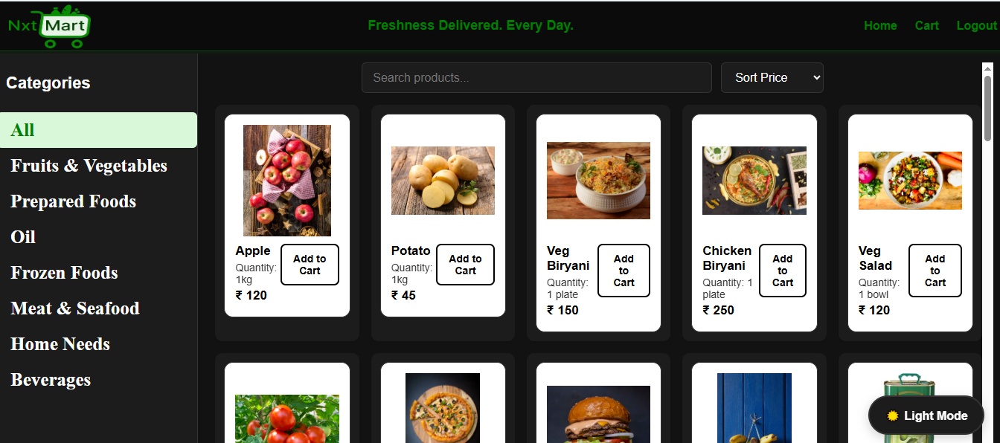
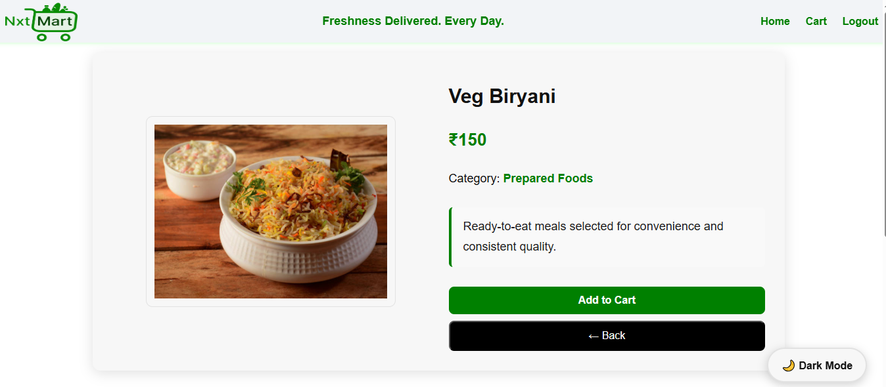
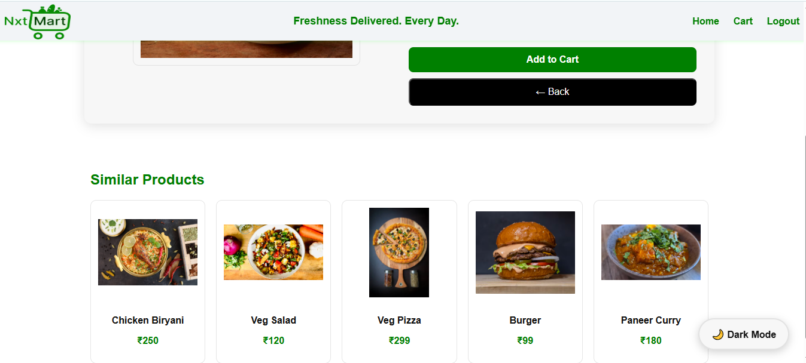
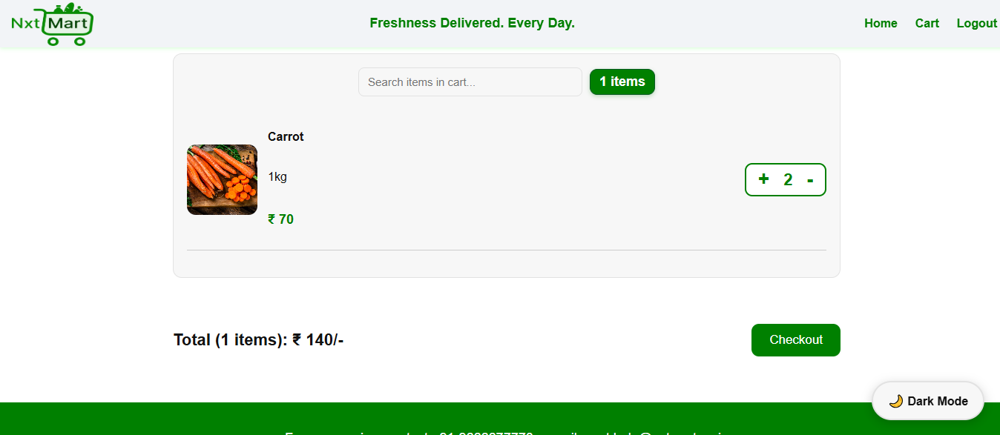
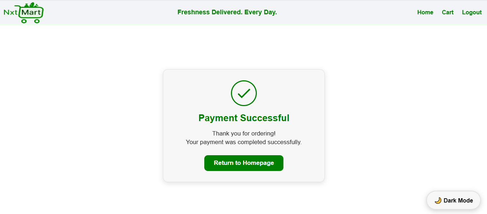

# 🛍️ NxMart - Full Stack Ecommerce Application

A modern, responsive and secure grocery e-commerce platform built using React + Styled Components, Node.js + Express, SQLite, and JWT Authentication.

---

### Live Demo

| Service                     | URL                                                                                    |
| --------------------------- | -------------------------------------------------------------------------------------- |
| 🌐 **Frontend (Vercel)**    | [https://frontend-nxt-mart-ctio.vercel.app](https://frontend-nxt-mart-ctio.vercel.app) |
| 🔌 **Backend API (Render)** | [https://nxtmartbackend-5.onrender.com](https://nxtmartbackend-5.onrender.com)          |

### 🚀 Overview
NxMart is a fully functional e-commerce application where users can:

- Browse products by categories
- Search & sort products
- View product details
- Add/remove items from cart
- Checkout securely (protected routes)
- Toggle between light & dark themes
- Stay authenticated using JWT tokens

This project follows clean architecture, controller-based backend, and modular folder structure used in real industry projects.

### 🧩 Key Features

| Feature                      | Description                                                   |
| ---------------------------- | ------------------------------------------------------------- |
| 🔐 **JWT Authentication**    | Secure SignUp, Login with Zod validation                      |
| 🛒 **Cart System**           | Add to Cart, update quantity, localStorage sync               |
| 🗂️ **Product Catalog**      | Category filters, search, sorting, product detail view        |
| 🌗 **Dark / Light Mode**     | Theme toggler with persistence                                |
| 🔄 **Protected Routes**      | Access control for cart & checkout                            |
| 🧱 **Backend Controllers**   | Clean separation of routes & logic                            |
| 💾 **SQLite Database**       | Lightweight, fast and easy to deploy                          |
| 📱 **Responsive UI**         | Styled-components with mobile-first design                    |
| ⚡ **Optimized API Queries**  | Secure search, safe sorting whitelist                         |
| 🧰 **Full Stack Separation** | Independent frontend + backend repos connected via submodules |


### 🏗️ Full Stack Architecture

```
NxMart-Fullstack/
│── frontend/   ← React App (submodule)
│── backend/    ← Node.js + Express API (submodule)
└── README.md

```

Each repo is managed and deployed independently but represented together in a clean full-stack structure for interviews & portfolio.

### 🗃️ Frontend Tech Stack

- React.js (Functional Components)
- Styled Components (Theming + Modular styles)
- React Router (Protected Routes)
- LocalStorage + Cookies
- Zod (Client-side validation)
- Vercel (Deployment)

### 🛠️ Backend Tech Stack

- Node.js + Express.js
- SQLite3 Database
- JWT Authentication
- Controllers + Routes architecture
- Zod Validation
- Bcrypt password hashing
- Render (Deployment)

### 📁 Final Project Folder Structure

```
NxMart-Fullstack/
│
├── frontend/
│   ├── src/
│   │   ├── pages/
│   │   │   ├── Home/
│   │   │   ├── Login/
│   │   │   ├── Signup/
│   │   │   ├── Cart/
│   │   │   ├── Checkout/
│   │   │   └── ProductDetails/
│   │   ├── components/
│   │   ├── theme/
│   │   ├── api/
│   │   ├── layouts/
│   │   └── App.jsx
│   │
│   └── public/
│
└── backend/
    ├── src/
    │   ├── config/
    │   ├── controllers/
    │   ├── middleware/
    │   ├── routes/
    │   ├── validators/
    │   └── server.js
    │
    └── Database/

```

### 🔌 Backend API Endpoints

| Method | Endpoint         | Description         |
| ------ | ---------------- | ------------------- |
| `POST` | `/auth/register` | Create new user     |
| `POST` | `/auth/login`    | Login & receive JWT |

### Products

| Method | Endpoint        | Description                    |
| ------ | --------------- | ------------------------------ |
| `GET`  | `/products`     | List all products with filters |
| `GET`  | `/products/:id` | Get single product details     |

### Filtering + Sorting Parameters

```
GET /products?search_q=&category=&order_by=&order=
```

| Param    | Description               |
| -------- | ------------------------- |
| search_q | search by product name    |
| category | filter category           |
| order_by | id, price, name, category |
| order    | ASC / DESC                |


## 🛠️ Local Development Setup
### 1️⃣ Clone the Fullstack Repo
```
git clone <fullstack-repo-url>
cd NxMart-Fullstack

```
### 2️⃣ Backend Setup
```
cd backend
npm install
npm start

```
Runs on:
```
👉 http://localhost:5000
```
### 3️⃣ Frontend Setup
```
cd ../frontend
npm install
npm start

```
Runs on:
```
👉 http://localhost:3000
```

### 🚀 Deployment Details

| Service     | Provider | Status     |
| ----------- | -------- | ---------- |
| Frontend    | Vercel   | ✅ Live     |
| Backend API | Render   | ✅ Live     |
| Database    | SQLite   | Local file |

### ✨ Why This Project Stands Out (Interview Points)

✔️ Clean Full-Stack Architecture
✔️ Proper controllers & route separation
✔️ Secure JWT auth implementation
✔️ Optimized product endpoints with safe sorting
✔️ Dark/Light theme implementation
✔️ Professional folder organization
✔️ Clean reusable styled-components
✔️ Protected routes using higher-order component
✔️ Well-structured README (this one 😄)

### 🙋‍♂️ Author

Venkatesh Karthan
Full-Stack Developer | MERN | Python | SQL
GitHub: https://github.com/venkatesh5650
```
## ScreenShots
### SignupPage

### Login Page

### Home Light Mode Page

### Home Dark Mode Page

### Product Details Page

###  Similar Products Page

### Cart Page

### Checkout Page


```
